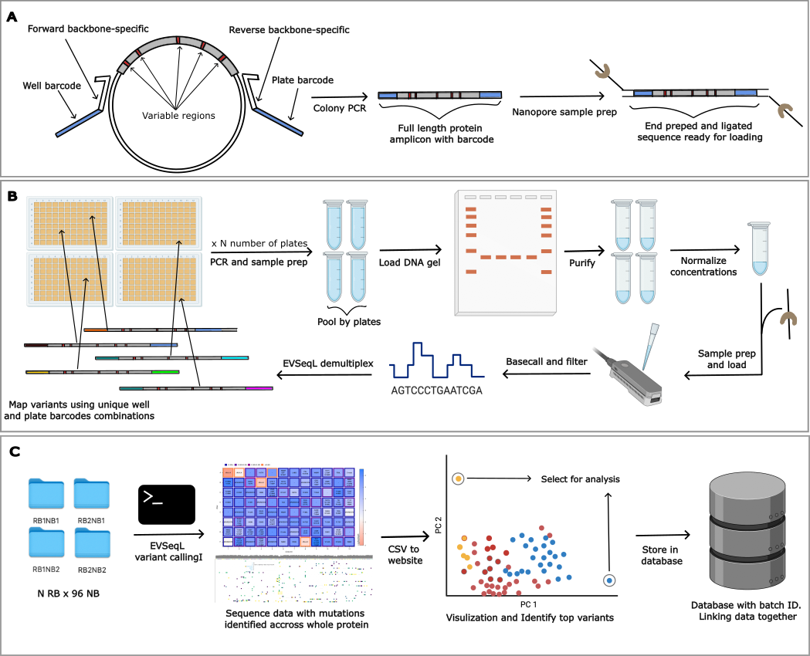

# Variant Sequencing with Nanopore

In directed evolution, sequencing every variant enhances data insight and creates datasets suitable for AI/ML methods. This method is presented as an extension of the original Every Variant Sequencer using Illumina technology. With this approach, sequence variants can be generated within a day at an extremely low cost.


Figure 1: Overview of the LevSeq variant sequencing workflow using Nanopore technology. This diagram illustrates the key steps in the process, from sample preparation to data analysis and visualization.


- Data to reproduce the results and to test are available on zenodo [](https://doi.org/10.5281/zenodo.13694463)

- A dockerized website and database for labs to locally host and visualize their data: website is available at: https://levseq.caltech.edu/ and code to host locally at: https://github.com/fhalab/LevSeq_VDB/

## Setup

For setting up the experimental side of LevSeq we suggest the following preparations:

- Order forward and reverse primers compatible with the desired plasmid, see methods section of [our paper](http://biorxiv.org/cgi/content/short/2024.09.04.611255v1?rss=1).
- Successfully install Oxford Nanopore's software (this is only for if you are doing basecalling/minION processing). [Link to installation guide](https://nanoporetech.com/).

## How to Use LevSeq

The wet lab part is detailed in the method section of the paper. 

Once samples are prepared, the multiplexed sample is used for sequencing, and the sequencing data is stored in the `../data` folder as per the typical Nanopore flow (refer to Nanopore documentation for this).

After sequencing, you can identify variants, demultiplex, and combine with your variant function here! For simple applications, we recommend using the notebook `example/Example.ipynb`.

### Steps of LevSeq:

1. **Basecalling**: This step converts Nanopore's FAST5 files to sequences. For basecalling, we use Nanopore's basecaller, Medaka, which can run in parallel with sequencing (recommended) or afterward.

2. **Demultiplexing**: After sequencing, the reads, stored as bulk FASTQ files, are sorted. During demultiplexing, each read is assigned to its correct plate/well combination and stored as a FASTQ file.

3. **Variant Calling**: For each sample, the consensus sequence is compared to the reference sequence. A variant is called if it differs from the reference sequence. The success of variant calling depends on the number of reads sequenced and their quality.


### Installation:

We aimed to make LevSeq as simple to use as possible, this means you should be able to run it all using pip. However, if you have issues we recomend using the Docker instance!

We recommend using command line interface(Terminal) and a conda environment for installation:
```
git clone https://github.com/fhalab/LevSeq.git
```

```
conda create --name levseq python=3.8 -y
```

```
conda activate levseq
```

From the LevSeq folder, install the package using pip:

```
pip install levseq
```
#### Dependencies 

1. Samtools: https://www.htslib.org/download/ 
```
conda install -c bioconda -c conda-forge samtools
```
or for mac users you can use: `brew install samtools`

2. Minimap2: https://github.com/lh3/minimap2
```
conda install -c bioconda -c conda-forge minimap2
```
or for mac users you can use: `brew install minimap2`
Once dependencies are all installed, you can run LevSeq using command line.
3. GCC version 13 and 14 are both needed
For Mac M chip users: installation via homebrew
```
brew install gcc@14
brew install gcc@13
```
For Linux users: installation via conda 
```
conda install conda-forge::gcc=14
conda install conda-forge::gcc=13
```

### Usage
#### Command Line Interface
LevSeq can be run using the command line interface. Here's the basic structure of the command:

```
levseq <name> <location to data folder> <location of reference csv file>
```
#### Required Arguments
1. Name of the experiment, this will be the name of the output folder
2. Location of basecalled fastq files, this is the direct output from using the MinKnow software for sequencing
3. Location of reference csv file, this file includes information of barcodes used for each plate and the DNA sequence used for reference for each plate

#### Optional Arguments
--skip\_demultiplexing If enabled, demultiplexing step will be skipped 

--skip\_variantcalling If enabled, variant valling step will be skipped 

--output Save location for output, if not provided default to where the program is executed

--show\_msa Showing multiple sequence alignment for each well

### Docker Installation (Recommended for full pipeline)  
For installing the whole pipeline, you'll need to use the docker image. For this, install docker as required for your 
operating system (https://docs.docker.com/engine/install/).


To build the docker image run (within the main folder that contains the `Dockerfile`):

```
docker build -t levseq .
```

This gives us the access to the lebSeq command line interface via:

```
docker run levseq
```
Note! The docker image should work with linux, and mac, however, different mac architectures may have issues (owing to the different M1/M3 processers.)

Basically the -v connects a folder on your computer with the output from the minION sequencer with the docker image that will take these results and then perform 
demultiplexing and variant calling.

```
 docker run -v /Users/XXXX/Documents/LevSeq/data:/levseq_results/ levseq 20240502 levseq_results/20240502/ levseq_results/20240502-YL-ParLQ-ep2.csv
```

In this command: `/Users/XXXX/Documents/LevSeq/data` is a folder on your computer, which contains a subfolder `20240502` 

### Issues and Troubleshooting

If you have any issues, please check the LevSeq\_error.log find in the output direectory and report the issue. If the problem persists, please open an issue on the GitHub repository with the error details.

If you solve something code wise, submit a pull request! We would love community input.
