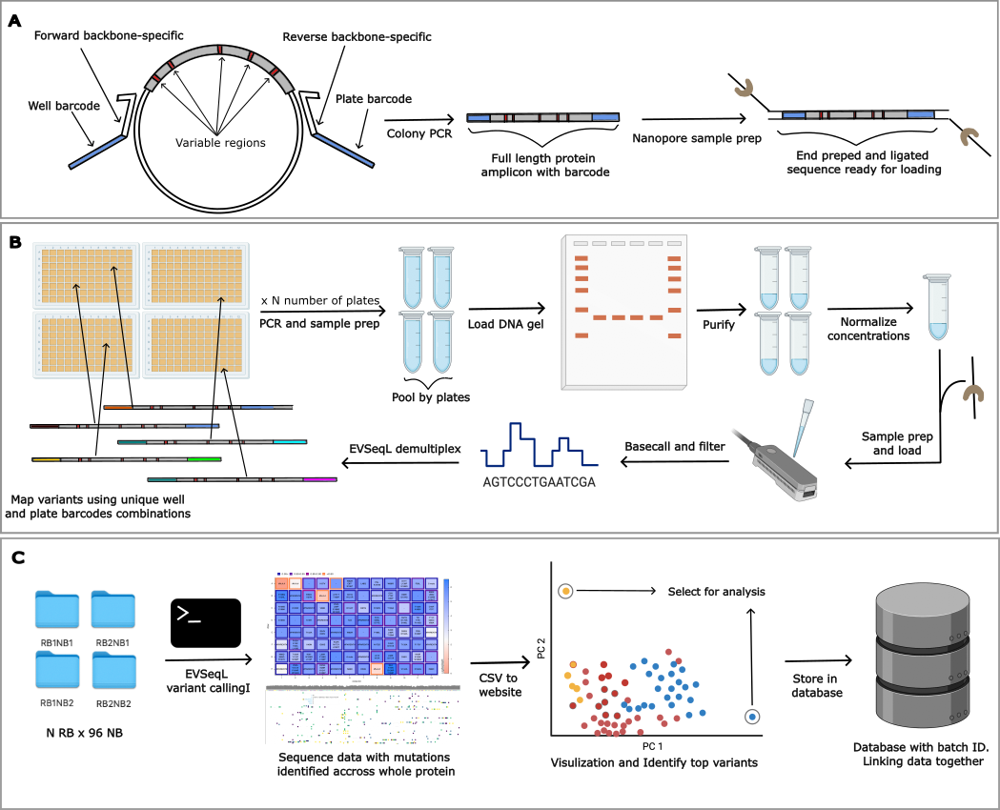

# Variant Sequencing with Nanopore

In directed evolution, sequencing every variant enhances data insight and creates datasets suitable for AI/ML methods. This method is presented as an extension of the original Every Variant Sequencer using Illumina technology. With this approach, sequence variants can be generated within a day at an extremely low cost.


Figure 1: Overview of the LevSeq variant sequencing workflow using Nanopore technology. This diagram illustrates the key steps in the process, from sample preparation to data analysis and visualization.


- Data to reproduce the results and to test are available on zenodo [](https://doi.org/10.5281/zenodo.13694463)
- A dockerized website and database for labs to locally host and visualize their data: website is available [here](https://github.com/ArianeMora/LevSeq_vis/) and code to host locally at: https://github.com/fhalab/LevSeq_VDB/

## Setup

For setting up the experimental side of LevSeq we suggest the following preparations:

- Order forward and reverse primers compatible with the desired plasmid, see methods section of [our paper](http://biorxiv.org/cgi/content/short/2024.09.04.611255v1?rss=1).
- Successfully install Oxford Nanopore's software (this is only for if you are doing basecalling/minION processing). [Link to installation guide](https://nanoporetech.com/).

## How to Use LevSeq

The wet lab part is detailed in the method section of the paper or via the [wiki](https://github.com/fhalab/LevSeq/wiki/Experimental-protocols).

Once samples are prepared, the multiplexed sample is used for sequencing, and the sequencing data is stored in the `../data` folder as per the typical Nanopore flow (refer to Nanopore documentation for this).

After sequencing, you can identify variants, demultiplex, and combine with your variant function here! For simple applications, we recommend using the notebook `example/Example.ipynb`.

### Installation

We aimed to make LevSeq as simple to use as possible, this means you should be able to run it all using pip (note you need `samtools` 
and `minimap2` installed on your path. However, if you have issues we recommend using the Docker instance! 
(the pip version doesn't work well with mac M3 but docker does.)

We recommend using terminal and a conda environment for installation:

```
conda create --name levseq python=3.10 -y
```

```
conda activate levseq
```

#### Dependencies 

1. Samtools: https://www.htslib.org/download/ 
```
conda install -c bioconda -c conda-forge samtools
```
or for mac users you can use: `brew install samtools`

2. Minimap2: https://github.com/lh3/minimap2

```
conda install -c bioconda -c conda-forge minimap2
```
### Docker Installation (Recommended for full pipeline)  
For installing the whole pipeline, you'll need to use the docker image. For this, install docker as required for your 
operating system (https://docs.docker.com/engine/install/).

### Usage

#### Run via pip
```
levseq <name of the run you can make this whatever> <location to data folder> <location of reference csv file>
```
#### Run via docker
```
docker run --rm -v "$(pwd):/levseq_results" levseq <name> <location to data folder> <location of reference csv file>
```
See the [manuscrtipt notebook](https://github.com/fhalab/LevSeq/blob/main/manuscript/notebooks/epPCR_10plates.ipynb) for an example.

#### Required Arguments
1. Name of the experiment, this will be the name of the output folder
2. Location of basecalled fastq files, this is the direct output from using the MinKnow software for sequencing
3. Location of reference csv file, this file includes information of barcodes used for each plate and the DNA sequence used for reference for each plate

#### Optional Arguments
--skip\_demultiplexing If enabled, demultiplexing step will be skipped 

--skip\_variantcalling If enabled, variant valling step will be skipped 

--output Save location for output, if not provided default to where the program is executed

--show\_msa Showing multiple sequence alignment for each well

Great you should be all done!

For more details or trouble shooting please look at our [computational_protocols](https://github.com/fhalab/LevSeq/wiki/Computational-protocols).

#### Citing

If you have found LevSeq useful, please cite out [paper](https://doi.org/10.1101/2024.09.04.611255).