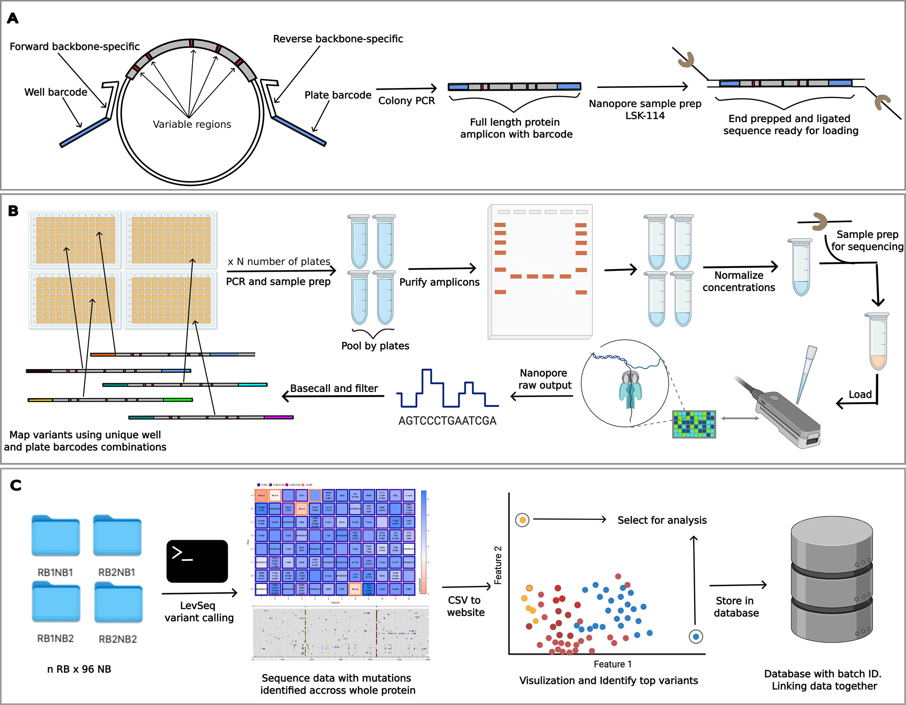

# Variant Sequencing with Nanopore

In directed evolution, sequencing every variant enhances data insight and creates datasets suitable for AI/ML methods. This method is presented as an extension of the original Every Variant Sequencer using Illumina technology. With this approach, sequence variants can be generated within a day at an extremely low cost.


Figure 1: Overview of the LevSeq variant sequencing workflow using Nanopore technology. This diagram illustrates the key steps in the process, from sample preparation to data analysis and visualization.

## Website
A beta website is available [here](https://levseqdb.streamlit.app/) you just load directly your output from LevSeq and your LCMS results and get visualisations and per plate normalizations.

## Data

- Data to reproduce the results and to test are available on zenodo [](https://doi.org/10.5281/zenodo.13694463)
- A dockerized website and database for labs to locally host and visualize their data:  website is available [here](https://levseqdb.streamlit.app/) and code to host locally [here](https://github.com/fhalab/LevSeq_db)

## Setup

For setting up the experimental side of LevSeq we suggest the following preparations:

- Order forward and reverse primers compatible with the desired plasmid, see methods section of [our paper](https://pubs.acs.org/doi/10.1021/acssynbio.4c00625).
- Successfully install Oxford Nanopore's software (this is only for if you are doing basecalling/minION processing). [Link to installation guide](https://nanoporetech.com/).

## How to Use LevSeq

The wet lab part is detailed in the method section of the paper or via the [wiki](https://github.com/fhalab/LevSeq/wiki/Experimental-protocols).

Once samples are prepared, the multiplexed sample is used for sequencing, and the sequencing data is stored in the `../data` folder as per the typical Nanopore flow (refer to Nanopore documentation for this).

After sequencing, you can identify variants, demultiplex, and combine with your variant function here! For simple applications, we recommend using the notebook `example/Example.ipynb`.

### Installation

### Docker Installation (Recommended for full pipeline)  
For installing the whole pipeline, you'll need to use the docker image. For this, install docker as required for your 
operating system (https://docs.docker.com/engine/install/).

Once you have docker installed and running you can run the following command:

If using a linux system pull the linux image:
```
docker pull yueminglong/levseq:levseq-1.4-x86
```
If using Mac M chips (image tested on M1, M3, and M4) pull the 
```
docker pull yueminglong/levseq:levseq-1.4-arm64
```

#### Run via docker

When using docker make sure you check for the latest version here: https://hub.docker.com/r/yueminglong/levseq/tags

```
docker run --rm -v "$(pwd):/levseq_results" yueminglong/levseq:levseq-1.2.5-<architecture> <name> <location to data folder> <location of reference csv file>
```

Example command:

```
docker run --rm -v "/home/user/Documents/nanopore_data/:/levseq_results" yueminglong/levseq:levseq-1.2.5-arm64 my_first_run levseq_results/ levseq_results/ref.csv
```
Within the folder `/home/user/Documents/nanopore_data/` (note this has to be the FULL path) located on your computer you should have the `fastq_pass` files (these can be in a subfolder) and also a file called `ref.csv` which has your parent sequence in it (it needs the columns below).

### Example ref.csv

| barcode_plate | name   | refseq    |
|---------------|--------|-----------|
| 33            | Q97A76 | ATGCGC... |
| 33            | Q97A76 | ATGCGC... |

##### Explanation:

`--rm`: Automatically removes the container after the command finishes.

`-v "$(pwd):/levseq\_results"`: Mounts the current directory ($(pwd)) (alternatively pass a full path here) to /levseq\_results inside the container, ensuring the results are saved to your current directory.

`yueminglong/levseq:levseq-1.2.5-\<architecture\>`: Specifies the Docker image to run. Replace \<architecture\> with the appropriate platform (e.g., x86).

`\<name\>`: The name or identifier for the analysis.

`\<location to data folder\>`: Path to the folder containing input data.

`\<location of reference csv file\>`: Path to the reference .csv file.

##### Important Notes:

If the current directory is mounted to the container (via -v "$(pwd):/levseq\_results"), the basecalled result in FASTQ format and the ref.csv file must be located in the current directory.

If these files are not present in the current directory, they will not be processed by the tool.

#### Output:

The results of the analysis will be saved to your current working directory.

See the [manuscrtipt notebook](https://github.com/fhalab/LevSeq/blob/main/manuscript/notebooks/epPCR_10plates.ipynb) for an example.
*Note: if using docker, the html and csv final output will be saved in the directory that you are running from instead of in the Platemaps or Results subfolder.

#### Required Arguments
1. Name of the experiment, this will be the name of the output folder
2. Location of basecalled fastq files, this is the direct output from using the MinKnow software for sequencing
3. Location of reference csv file, this file includes information of barcodes used for each plate and the DNA sequence used for reference for each plate

#### Optional Arguments
--skip\_demultiplexing If enabled, demultiplexing step will be skipped 

--skip\_variantcalling If enabled, variant valling step will be skipped 

--output Save location for output, if not provided default to where the program is executed

--show\_msa Showing multiple sequence alignment for each well

Great you should be all done!

For more details or trouble shooting please look at our [computational_protocols](https://github.com/fhalab/LevSeq/wiki/Computational-protocols).

### Running via pip (mac and linux only)
We also typically run LevSeq directly using the pip install (note you need `samtools` 
and `minimap2` installed on your path. However, if you have issues we recommend using the Docker instance! 
(the pip version doesn't work well with mac M3 but docker does.)

We recommend using terminal and a conda environment for installation:

```
conda create --name levseq python=3.12 -y
```

```
conda activate levseq
```

```
pip install levseq
```

#### Dependencies for pip version 

1. Samtools: https://www.htslib.org/download/ 
```
conda install -c bioconda -c conda-forge samtools
```

2. Minimap2: https://github.com/lh3/minimap2

```
conda install -c bioconda -c conda-forge minimap2
```
3. gcc 13 and 14 on Mac M1 through M4 chips
```
brew install gcc@13
brew install gcc@14
```

### Usage

#### Run via pip
```
levseq <name of the run you can make this whatever> <location to data folder> <location of reference csv file>
```

### Running as an oligopool 
For those of you who are interested in using this for multiple proteins (i.e. many different proteins on a plate) you may want to use our oligopool demultiplexing. 

The experimental side is the same as the original LevSeq, however, we have updated the code to handle multiple proteins. For this you add the flag: `--oligopool` and the `ref.csv` 
is formatted slightly differently, for example, say you have two barcodes, each with two potential enzymes you would have in your `ref.csv`.

| barcode_plate | name   | refseq    |
|---------------|--------|-----------|
| 33            | Q97A76 | ATGCGCAAG |
| 33            | P96084 | ATGGATCA  |
| 34            | P46209 | ATGGGGCAA |
| 34            | Q60336 | ATGGGGCC  |

#### Citing

If you have found LevSeq useful, please cite our [paper](https://pubs.acs.org/doi/10.1021/acssynbio.4c00625).

```bibtex
@article{long2024levseq,
  title={LevSeq: Rapid Generation of Sequence-Function Data for Directed Evolution and Machine Learning},
  author={Long, Yueming and Mora, Ariane and Li, Francesca-Zhoufan and Gürsoy, Emre and Johnston, Kadina E and Arnold, Frances H},
  journal={ACS Synthetic Biology},
  year={2024},
  publisher={American Chemical Society}
}
```

#### Contact

Leave a feature request in the issues or reach us via [email](mailto:levseqdb@gmail.com). 
